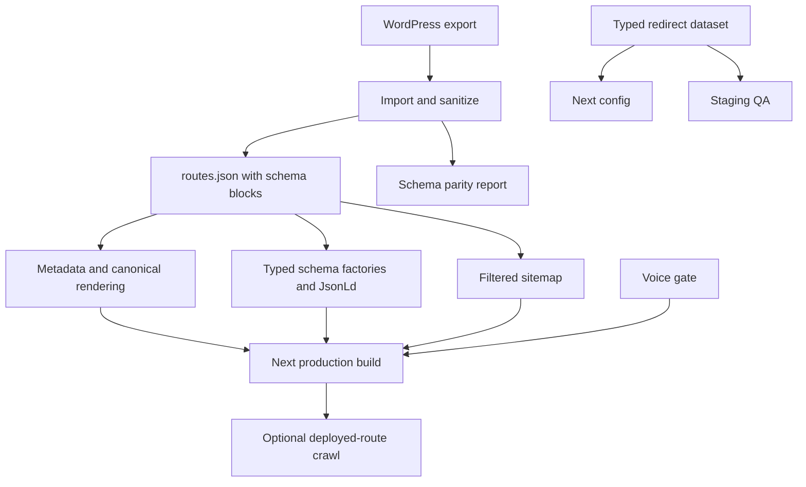

# Local P0 Staging Readiness

## Summary

Bring the current Next.js rebuild to a locally verifiable staging-ready baseline without depending on Peter, Vercel, GSC, DNS, or a CMS decision. The work fixes brand and build failures, introduces reusable SEO infrastructure, strengthens migration parity, and makes QA reproducible in CI.

---

## Problem frame

The site renders most imported routes, but it cannot clear the supplied Phase 1 gates. Exact brand tokens are wrong, redirects are hard-coded, RankMath schema is discarded, the voice check is incomplete, production robots lacks explicit AI crawler rules, OG images are not generated, React-owned images bypass optimization, lint fails, sitemap entries include noindex routes, the tracked URL basket is incomplete, and no staging QA workflow exists.

---

## Requirements

### Brand and content enforcement

- R1. Use navy `#1B2A4A` and gold `#F5A623` as the canonical brand tokens while retaining named secondary tokens only where existing UI needs them.
- R2. Reject source and generated HTML containing vendor terms or the full banned-phrase list defined by the briefs.
- R3. Preserve preview noindex behavior while explicitly allowing approved AI crawlers in production.

### Routing and metadata

- R4. Move redirects into one typed dataset consumed by Next.js configuration and QA, preserving the five currently known redirects.
- R5. Keep `trailingSlash: true`, canonical paths, and the frozen money-page URL unchanged.
- R6. Generate dynamic branded OG images when a migrated RankMath/featured image is unavailable.
- R7. Exclude noindex routes from the sitemap and keep sitemap URLs canonical.

### Schema parity

- R8. Make `JsonLd` generic over a typed Schema.org union rather than `unknown`.
- R9. Provide typed factories for Organization, WebSite, WebPage, Article, FAQPage, HowTo, Product, and BreadcrumbList.
- R10. Preserve parseable RankMath schema blocks during WordPress import and render them before generic fallback schema.
- R11. Record a generated page-by-page schema parity artifact with source types, runtime types, and unresolved serialized blocks.

### Build and quality

- R12. Replace React-owned raw `` elements with `next/image`; migrated HTML remains preserved and constrained because converting arbitrary WordPress HTML is outside this unit.
- R13. Resolve the current React hooks lint error without changing visible count-up behavior or reduced-motion support.
- R14. Expand the tracked URL basket to 21 existing priority routes and keep all 15 tracked prompts typed.
- R15. Add staging QA scripts and a GitHub workflow covering type-check, lint, brand gate, route QA, redirect validation, production build, and optional deployed-route crawl.

---

## Key technical decisions

- KTD1. **Keep migration data as the source of truth:** enrich `routes.json` during import instead of maintaining schema overrides by hand.
- KTD2. **Decode the RankMath subset locally:** support JSON schema blocks and the PHP-serialized array/string/integer structures present in the supplied export; unresolved blocks are reported rather than guessed.
- KTD3. **Use a generic OG endpoint:** `/api/og` renders title and brand treatment through `ImageResponse`; existing page-specific images remain first choice.
- KTD4. **Separate configured redirects from missing business decisions:** the framework lands now, but the unprovided 85-row redirect list and `/embedded-sim/` decision remain external dependencies.
- KTD5. **Treat generated HTML as the brand-gate target:** source checks prevent new violations while post-build checks catch migrated content and metadata leaks.
- KTD6. **Keep staging closed by default:** non-production robots and metadata remain noindex/disallow even while production explicitly allows approved AI crawlers.

---

## High-level technical design

---

## Implementation units

### U1. Brand tokens and production crawler policy

- **Goal:** Satisfy R1 and R3 without changing staging safety.
- **Files:** Modify `site/src/app/globals.css` and `site/src/app/robots.ts`.
- **Patterns:** Reuse CSS custom properties and `MetadataRoute.Robots` already present.
- **Test scenarios:** Production rules contain the standard block plus all eight named AI crawlers; preview rules still disallow `/`; computed tokens expose the two exact brief colors.
- **Verification:** Type-check and inspect generated `/robots.txt` under preview and production environment values.

### U2. Redirect data and validation framework

- **Goal:** Satisfy R4 and preserve R5.
- **Files:** Create `site/src/data/redirects.ts` and `site/scripts/validate-redirects.mjs`; modify `site/next.config.ts` and `site/package.json`.
- **Patterns:** Keep Next.js permanent redirect objects and trailing-slash policy.
- **Test scenarios:** Current aliases redirect permanently; source paths are unique; destinations are normalized local paths; loops and self-redirects fail validation.
- **Verification:** Run redirect validator and request each known source from the dev server.

### U3. Typed schema layer

- **Goal:** Satisfy R8 and R9.
- **Files:** Create `site/src/lib/schema/types.ts` and `site/src/lib/schema/factories.ts`; convert `site/src/lib/schema.ts` into a compatibility barrel; modify `site/src/components/seo/json-ld.tsx`.
- **Patterns:** Preserve the current Organization/WebSite exports consumed by the homepage.
- **Test scenarios:** Factories return valid context/type shapes; FAQ and HowTo require non-empty entities/steps; JSON serialization escapes `<`.
- **Verification:** Type-check and Node-level schema factory tests.

### U4. RankMath schema import and parity report

- **Goal:** Satisfy R10 and R11.
- **Files:** Create `site/scripts/lib/php-unserialize.mjs` and `site/scripts/lib/schema-normalizer.mjs`; modify `site/scripts/import-wordpress-export.mjs`, `site/src/data/migration/routes.json`, and `site/src/app/[...slug]/page.tsx`; generate `migration-output-2026-06-17/schema-parity.csv`.
- **Patterns:** Follow the existing importer's sanitization, metadata fallback, and deterministic JSON output.
- **Test scenarios:** JSON `article_schema` parses; serialized FAQPage and HowTo blocks parse; RankMath placeholders resolve from route fields; malformed blocks are reported; generic schema appears only when no imported schema exists.
- **Verification:** Re-run import, compare route count, inspect `/dashcams/` for FAQPage/HowTo/Article output, and confirm the money-page URL is unchanged.

### U5. OG metadata and image optimization

- **Goal:** Satisfy R6 and R12.
- **Files:** Create `site/src/app/api/og/route.tsx`; modify `site/src/app/layout.tsx`, `site/src/app/[...slug]/page.tsx`, `site/src/components/editorial/article-card.tsx`, `site/src/components/editorial/article-page.tsx`, `site/src/components/layout/site-header.tsx`, `site/src/app/page.tsx`, and `site/next.config.ts`.
- **Patterns:** Use `next/og` and `next/image`; preserve existing migrated image URLs as first-choice OG images.
- **Test scenarios:** Pages with imported images retain them; pages without images use `/api/og`; OG route handles long titles; optimized React-owned images retain dimensions and alt behavior.
- **Verification:** Lint has no raw-image warnings and OG endpoint returns an image response.

### U6. Voice gate and sitemap cleanup

- **Goal:** Satisfy R2 and R7.
- **Files:** Modify `site/scripts/check-forbidden-terms.mjs`, `site/src/app/sitemap.ts`, and `site/package.json`; create `site/scripts/check-built-content.mjs`.
- **Patterns:** Keep the current recursive source scanner and migration robots metadata.
- **Test scenarios:** Every banned phrase fails source or built-output checks; allowlisted technical CSS usage does not trigger copy checks; noindex routes are absent from sitemap; indexable routes remain.
- **Verification:** Run source gate, build-output gate, and sitemap assertion script.

### U7. Lint fix and tracked measurement basket

- **Goal:** Satisfy R13 and R14.
- **Files:** Modify `site/src/components/home/count-up-stats.tsx`, `site/src/data/tracked-urls.ts`, and `site/src/data/tracked-prompts.ts` only if typing needs tightening.
- **Patterns:** Preserve existing IntersectionObserver/count-up behavior and typed constant arrays.
- **Test scenarios:** Reduced-motion users see final values; normal users animate after intersection; tracked URL count is 21; all paths exist in migration or dedicated routes; prompt count remains 15.
- **Verification:** ESLint, type-check, and measurement-data validator.

### U8. Staging QA automation

- **Goal:** Satisfy R15 and make every local P0 gate repeatable.
- **Files:** Create `site/scripts/qa-staging.mjs`, `site/scripts/validate-tracking-data.mjs`, and `.github/workflows/staging-qa.yml`; modify `site/package.json`.
- **Patterns:** Extend existing `qa-routes.mjs` and npm scripts rather than introducing a test framework.
- **Test scenarios:** QA fails on route errors, missing canonical, forbidden rendered text, wrong schema types, noindex sitemap inclusion, invalid redirects, incomplete tracking data, lint errors, or build failure.
- **Verification:** Run the complete local QA command; workflow mirrors the same commands with an optional `STAGING_BASE_URL` crawl.

---

## Scope boundaries

### Deferred pending external input

- The final 85 redirects and `/embedded-sim/` mapping.
- Deletion or noindex decisions for legacy ICT/AI posts.
- Sanity CMS setup and migration.
- Vercel log drain, project analytics, GSC, DNS, and cutover monitoring.

### Later phase

- FAQ/HowTo backfill beyond schemas already present in the source export.
- Country pages, comparison pages, use-case routes, glossary, case studies, multilingual content, and Insightly/Make.com integration.

---

## System-wide impact

The importer output changes shape by adding normalized schema blocks. Every migrated route consumes that output, so route count, paths, metadata, and content hashes must remain stable. The voice gate will initially fail because existing migrated copy violates the brief; implementation must produce a concrete violation report and sanitize only vendor placeholders automatically, leaving substantive copy changes visible for review.

---

## Risks and dependencies

- **RankMath serialization:** PHP-serialized custom schemas may contain types outside the observed subset. Unparsed blocks must remain visible in the parity report.
- **Brand gate rollout:** Enforcing all banned phrases immediately can block the build on preserved migrated copy. The gate needs a reviewed legacy-baseline mechanism so new violations fail without hiding old debt.
- **Remote images:** WordPress image hosts must be explicitly allowed in Next.js configuration; unknown hosts should retain safe unoptimized fallback rather than breaking pages.
- **Static generation cost:** Building 135 routes plus OG/schema work may exceed local execution limits; CI needs a longer timeout and retained logs.
- **Redirect completeness:** The framework can be correct while business coverage remains incomplete until the 85-row source is supplied.

---

## Acceptance examples

- AE1. Given a preview deployment, when `/robots.txt` is requested, then all crawlers are blocked and metadata is noindex.
- AE2. Given production, when `/robots.txt` is requested, then the standard rule and eight AI crawler allow rules are present.
- AE3. Given `/dashcams/`, when HTML is rendered, then source Article, FAQPage, and HowTo schemas appear through the typed JSON-LD renderer.
- AE4. Given a route without a source image, when metadata is generated, then its OG image points to the branded dynamic endpoint.
- AE5. Given a noindex route, when sitemap XML is generated, then that route is absent.
- AE6. Given a new banned phrase in source or generated HTML, when staging QA runs, then the command exits non-zero and identifies the file or URL.
- AE7. Given all local P0 changes, when the QA command runs, then type-check, lint, route checks, redirect checks, schema checks, brand checks, tracking checks, and production build succeed.

---

## Sources

- `docs/audits/2026-06-19-implementation-gap-audit.md`
- `site/src/data/migration/routes.json`
- `migration-output-2026-06-17/content-full.json`
- `migration-output-2026-06-17/url-map.csv`
- `site/next.config.ts`
- `site/src/app/robots.ts`
- `site/src/components/seo/json-ld.tsx`
- `site/scripts/import-wordpress-export.mjs`

